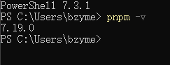
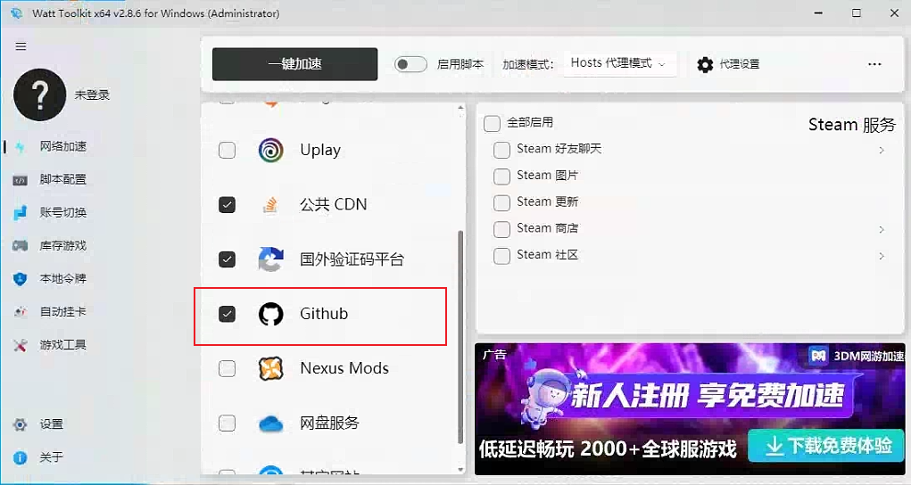
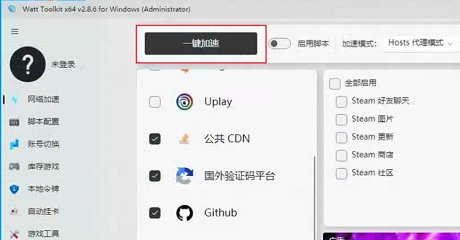
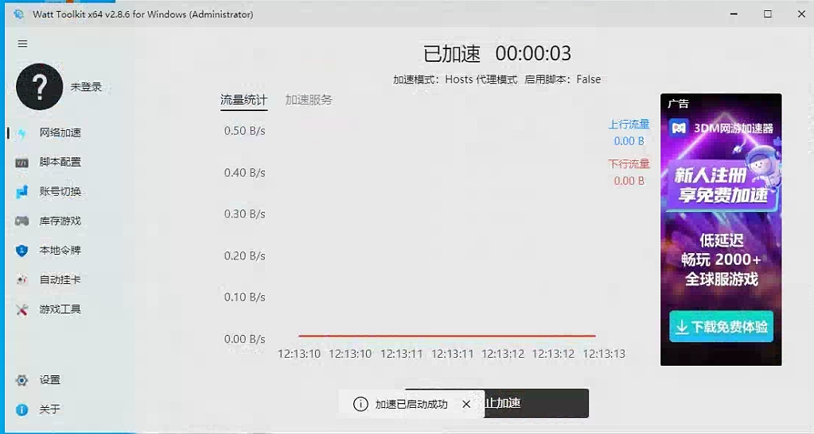
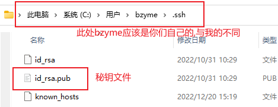
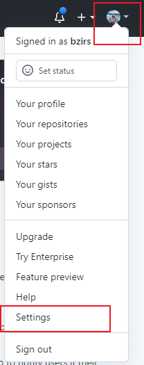
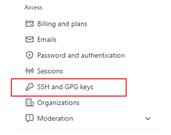
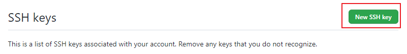
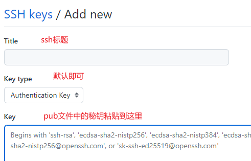

# 前端面试宝典

## 前言

  我个人习惯食用pnpm进行包管理(之后的项目实战也会让小组内所有人使用pnpm进行包管理)
  
  这个pnpm的使用方式跟npm的使用方式相同
  前往查看  --->  [官网](https://pnpm.io/zh/)

## 准备

### 安装pnpm

  一条命令即可

```
  npm -g i pnpm
```

#### 验证本地是否安装成功

使用命令验证是否安装成功pnpm,查看pnpm版本

```
pnpm -v
```



### 安装steam++

  把我发送的安装包安装到电脑中(这个应该不用教吧)

## 食用教程

### 使用steam++加速github

#### 打开steam++

桌面双击Watt Toolkit(steam++改名后的产品名)


#### 勾选github选项

在steam++打开后的首页，勾选github选项



或者像我一样也勾选其他两个选项

#### 加速github

  全部勾选后，直接点击上方的一键加速按钮，进行加速
  

  加速成功后画面

  

### 注册github账号

浏览器中访问[github](https://github.com)

注册链接 ----> [点我](https://github.com/signup?ref_cta=Sign+up&ref_loc=header+logged+out&ref_page=%2F&source=header-home)

按照提示输入邮箱、用户名(github唯一标识符不允许重复,可以多次修改用户名)等各种信息进行注册

记住自己的用户名,之后邀请加入仓库也要用到你的用户名


### github添加ssh秘钥

将本地秘钥添加到github 配置中,才可以使用ssh方式拉取上传代码

#### 本地ssh秘钥

本地秘钥位置存放在C盘盘符的用户文件夹下的自己计算机名文件夹中的.ssh文件夹

如图所示



使用vscode打开id_rsa.pub文件准备好文件内的秘钥

#### github添加秘钥

github主页上右上角个人头像点击,选择setting,跳转设置页



选择设置页左侧侧边栏中Access选项栏中的`SSH and GPG keys`



点击`new ssh key`



将准备好的ssh秘钥添加进去



最后点击`Add SSH key`保存即可
